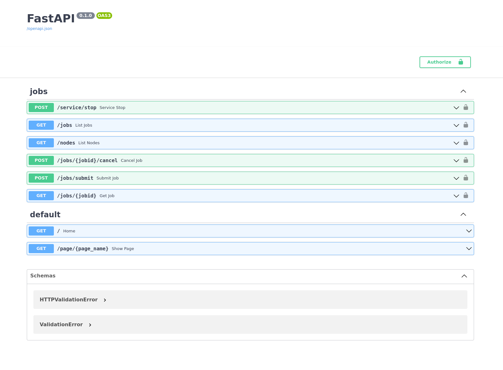

# Flux RESTFul API



This is a small Flux Python API (using FastAPI) that can be containerized
alongside Flux, and provide an easy means to interact with Flux via the API.
My goals are:

1. provide simple endpoints to submit jobs, list jobs, or get job status
2. eventually support subscribing to events
3. option to kill or stop the server (intended for Flux Operator)
4. allow for start with a user name and token (for basic auth)

The assumption for my use case is that we deploy this on the fly,
alongside a Flux broker, and we only need to authenticate for the single
user case. For the Flux Operator, if we can start a mini-cluster running
a server and then submit jobs to it and have it taken down by API call,
that would be really cool (and is what I plan to test.)

**under development!**

## Usage

Install dependencies:

```bash
$ python -m venv env
$ source env/bin/activate
$ pip install -r requirements.txt
```

Install requirements (note that you also need Flux Python available, which isn't in these requirements as you cannot install from pip).

```bash
$ pip install -r app-requirements.txt
```

There are two ways to start the app! You can either have it be the entry for flux start:

```console
$ flux start uvicorn app.main:app --host=0.0.0.0 --port=5000
```

Or do it separately (two commands):

```bash
$ flux start --test-size=4
$ uvicorn app.main:app --host=0.0.0.0 --port=5000
```

For the latter, you can also use the Makefile:

```bash
$ make
```
And the second might be ideal for development (it's easier).
If you want to require authentication for the user, export the user and token:

```bash
export FLUX_USER=$USER
export FLUX_TOKEN=123456
```

After starting, you can open your browser to [http://127.0.0.1:5000](http://127.0.0.1:5000)
to view the app interface. API endpoints are shown below, and see [examples](examples)
for a full client and example scripts to interact with your server. E.g.,:

```console
$ python3 examples/submit_job.py
```

### API

The following is the spec for the Flux Python RESTful API provided here:

### GET `/jobs`

List jobs owned by the flux executor (the current user).

### GET `/jobs/{uid}`

Get a job with a specific identifer.

### POST `/jobs/{uid}/cancel`

Cancel a job based on identifier.

### POST `/jobs/submit`

Submit a new job, required metadata in the post is:

 - command: a string of the command to run (required)
 - runtime: maximum runtime allowed (defaults to 0, unlimited, optional)


## Development

Install development requirements:

```bash
$ pip install -r dev-requirements.txt
```
And then run pre-commit manually, or install:

```bash
$ pre-commit run --all-files
```
Note that you should do this outside of the container!


## TODO

- Finish job submit / status endpoints
- Interface view with nice job table
- Basic authentication
- API endpoint to kill job server
- pre-commit and workflows to run it
- contributors action!
- We can put additional assets for the server in [data](data), not sure what those are yet!

#### Release

SPDX-License-Identifier: LGPL-3.0

LLNL-CODE-764420
